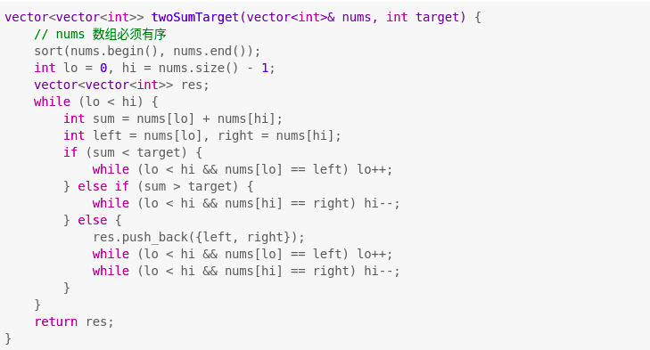
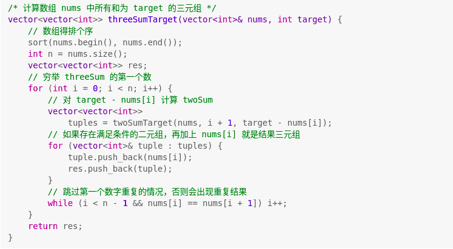

# 3Sum - Leetcode 15
Given an array nums of n integers, are there elements a, b, c in nums such that a + b + c = 0? 
Find all unique triplets in the array which gives the sum of zero.<br>
Notice that the solution set must not contain duplicate triplets.

Example 1:

Input: nums = [-1,0,1,2,-1,-4]
Output: [[-1,-1,2],[-1,0,1]]

Example 2:

Input: nums = []
Output: []

**stragety:** <br/>
[from two Sum to n Sum](https://leetcode-cn.com/problems/3sum/solution/yi-ge-fang-fa-tuan-mie-by-labuladong/)


- [TwoSum](#twosum)
  - [Double Pointer](#double-pointer)
  - [HashTable](#hashtable)

- [Three Sum](#three-sum)
- [Four Sum](#four-sum)
- [nSum](#n-sum)

**Summary**
- first use ```sort(arr.begin(), arr.end())``` to sort the unsorted array (Time Complexity: O(nlogn))
- to make sure the solution is unique, rememebr to move the pointer when meet duplicate number using stragety like this:
    ```
    // eliminate duplicate of first number of the triplets
    for (int i = 0; i <= nums.size() - 3; i++) {
        if (i > 0 && nums[i] == nums[i-1]) {
                continue;
        }
        ....
    // elimate duplicate in twoSum
    1) in while loop, store the left and right value
        if (sum < target) {
            while (lo < hi && nums[lo] == left) lo++;
        } 
    }
    ```
    :star: the usage of ```continue``` <br>
    :star: add ```lo < hi``` in the while loop to prevent the
            array to be out of range

- C++ knowledge :point_down:
    ```
    std::pair<int,int> mypair;
    mypair = std::make_pair(1,2);
    int a = mypair.first;
    int b = mypair.second;
    ```


### Two Sum
:star: if the array is sorted: -> use two pointe<br>
:star: if the return value is the index: -> use HashMap
#### Double Pointer
Sort the array, use two pointers stragety(相向双指针)<br>
- Time Compelxity: 
    - unsorted array: O（nlogn)(排序) + O(n)(双指针) = O(nlogn)<br>
    - sorted array: O(n)
- Space Complexity: O(1)<br>



#### HashTable
- Time Compelxity: O(n)<br>
- Space Complexity: O(n)<br>

|            | map     | unordered_map |
| ----------- | ----------- | ----------- |
|Ordering |increasing  order (by default)| no ordering
|Implementation  | Self balancing BST( like Red-Black Tree )| Hash Table
search time     | log(n)              | O(1) -> Average<br>O(n) -> Worst Case|
|Insertion time  | log(n) + Rebalance  | Same as search|
|Deletion time   | log(n) + Rebalance  | Same as search|

```
vector<int> twoSum(vector<int>& numbers, int target) {
	unordered_map<int, int> hash; //Number, Index
        
	for (int i = 0; i < numbers.size(); i++) {
		int numberToFind = target - numbers[i];

		if (hash.find(numberToFind) != hash.end()) 
			return  {hash[numberToFind] ,i };

		hash[numbers[i]] = i; //put number into the map
	}
	return {};
    }
```
### Three Sum
Traverse every number in sorted array to be the first number, use twoSum to compute the rest two numbers


### Four Sum
Traverse every number in sorted array as the first number, call three sum
### n Sum
```
/* 注意：调用这个函数之前一定要先给 nums 排序 */
vector<vector<int>> nSumTarget(
    vector<int>& nums, int n, int start, int target) {
    int sz = nums.size();
    vector<vector<int>> res;
    // 至少是 2Sum，且数组大小不应该小于 n
    if (n < 2 || sz < n) return res;
    // 2Sum 是 base case
    if (n == 2) {
        // 双指针那一套操作
        int lo = start, hi = sz - 1;
        while (lo < hi) {
            int sum = nums[lo] + nums[hi];
            int left = nums[lo], right = nums[hi];
            if (sum < target) {
                while (lo < hi && nums[lo] == left) lo++;
            } else if (sum > target) {
                while (lo < hi && nums[hi] == right) hi--;
            } else {
                res.push_back({left, right});
                while (lo < hi && nums[lo] == left) lo++;
                while (lo < hi && nums[hi] == right) hi--;
            }
        }
    } else {
        // n > 2 时，递归计算 (n-1)Sum 的结果
        for (int i = start; i < sz; i++) {
            vector<vector<int>> 
                sub = nSumTarget(nums, n - 1, i + 1, target - nums[i]);
            for (vector<int>& arr : sub) {
                // (n-1)Sum 加上 nums[i] 就是 nSum
                arr.push_back(nums[i]);
                res.push_back(arr);
            }
            while (i < sz - 1 && nums[i] == nums[i + 1]) i++;
        }
    }
    return res;
}

```
n == 2 时是 twoSum 的双指针解法，n > 2 时就是穷举第一个数字，然后递归调用计算 (n-1)Sum，组装答案。