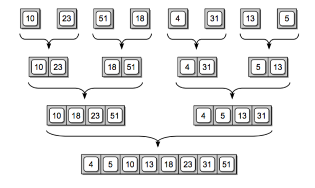
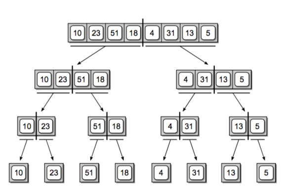

# Sort an Array - Leetcode 912
Given an array of integers nums, sort the array in ascending order.

Example 1:

Input: nums = [5,2,3,1]
Output: [1,2,3,5]
Example 2:

Input: nums = [5,1,1,2,0,0]
Output: [0,0,1,1,2,5]
 

**stragety:** <br/>

Divide and Conquer
- [Quick Sort](#quick-sort) (先整体有序 再局部有序）
  - [Double Pointer](#double-pointer)
  - [HashTable](#hashtable)

- [Merge Sort](#merge-sort)(先局部有序 再整体有序)
- [Four Sum](#four-sum)
- [nSum](#n-sum)

**Summary**
|Algorithm| best T| average T | worst T |
|---|---|---|---|
|Selection Sort|	O(n^2)|	O(n^2)|	O(n^2)|
|Bubble Sort|	O(n)|	O(n^2)|	O(n^2)	 |
|Insertion Sort|	O(n)|	O(n^2)|	O(n^2)	 |
|:star: Heap Sort|	O(n log(n))|	O(n log(n))|	O(n log(n))	 |
|:star: Quick Sort|	O(n log(n))|	O(n log(n))|	O(n^2)	 |
|:star: Merge Sort|	O(n log(n))|	O(n log(n))|	O(n log(n))	 |


### Quick Sort
**Time Complexity:** O(nlogn) worst case: O(n^2)<br>
**Space Complexity:** O(1)
- Accrually faster then merge sort because merge sort needs allocating extra space.

:star: define pivot as the value not the index, choose to be middle<br>
:star: compare left and right pointer: **<=**<br>
:star: compare left/right with pivot: **<**<br>
:star: remember to check if ```lPtr <= rPtr``` in while loop before swap
#### Merge Sort
3 steps: Divide, Conquer, Combine<br>
**Time Complexity:** O(nlogn) + O(n) = O(nlogn) <br>
**Space complexity:** O(n)<br>
It's much stable compared with quick sort

Divide: <br>
<br>
Combine:<br>



