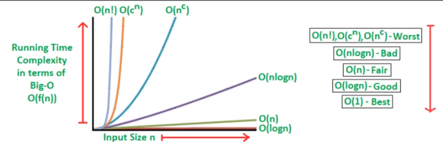

# Knowledge
- [Big O](#big-o) 
  - [Time Complexity](#time-complexity)
  - [Space Complexity](#space-complexity)

- [Merge Sort](#merge-sort)(先局部有序 再整体有序)
- [Four Sum](#four-sum)
- [nSum](#n-sum)

### Big 0
- For very large input size
- For worst case scenario
#### Time Complexity
 
:star: Drop lower order terms 
:star: Drop all the constant multipliers

1. Sequential Statements:
    * a = a + b //constant time: c1
    * **Loop:** for (i = 1; i < n; i++) {
        x = y + z; }   //c2n
    * **Nested Loop：** for (i = 1; i < n; i++) {
        for (j = 1; j < n; j++) {
        x = y + z; } } // c3n^2
    * overall: c1 + c2n + c3n^2 -> O(n^2)
2. Binary Search: T(N) = T(N/2) + c(constant time for check)
    * T(N/2) = T(N/4) + c -> T(N) = T(N/4) + 2c -> T(N) = T(N/2^i) + ic
    * **At some point, as N/2^i diminishes, we reach only 1 element:** T(N/2^i) = T(1)-> N = 2^i -> i = log N
    * T(N) = T(1) + clog N -> log N
    
3. Quick Sort / Merge Sort: T(n) = 2T(n/2) + O(n)
    * T(n/2) = 2T(n/4) + O(n/2) -> T(n) = 4T(n/4) + 2O(n) -> T(n) = 2^iT(n/2^i) + 2^iO(n)
    * i = log n
    * T(n) = O(n) + O(nlogn) = O(nlogn)

-> Time complexity for sorting algorithms:
 

#### Space Complexity
3 steps: Divide, Conquer, Combine

Divide: 
 
Combine:

Time Complexity: O(nlogn) + O(n) = O(nlogn)  
Space complexity: O(n) 
It's much stable compared with quick sort

